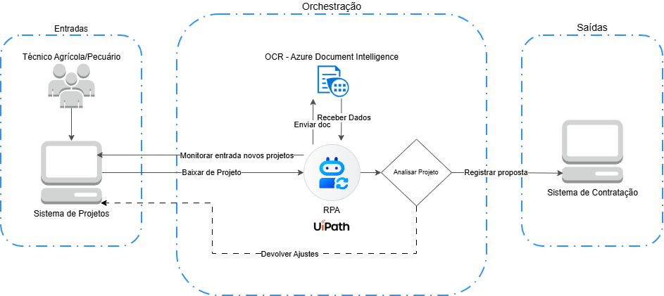

# 🤖 RPA — Triagem e Pré-cadastro de Projetos Técnicos (Crédito Rural)

> **Nota:** Este é um projeto corporativo. Por questões de governança e confidencialidade, o código-fonte não será disponibilizado neste repositório.

## 🧭 Resumo Executivo

Este repositório documenta um **RPA corporativo** desenvolvido para a área de **crédito**, com o objetivo de **reduzir o tempo e a latência operacional** entre a **emissão de projetos técnicos (custeio agrícola e pecuário)** e a **disponibilização da proposta para contratação**.

O RPA automatiza etapas críticas do fluxo, como **download de projetos**, **extração de dados via OCR**, **validação de conformidade** e **inserção na ferramenta de contratação**, garantindo **eficiência, rastreabilidade e redução de erros manuais**.

> Este não é um projeto conceitual ou acadêmico, mas uma **solução operacional aplicada**, construída sob restrições reais de tempo, equipe e governança.

---

## ❗ O problema que motivou a solução

Antes da implementação do RPA, o fluxo apresentava gargalos significativos:

- 📥 **Latência de entrada**: o atendente dependia do comparecimento do cliente para iniciar o processo manualmente.
- ⏳ **Tempo de execução manual**: análise e cadastro consumiam entre **15 e 30 minutos por caso**.
- 🧾 **Erros manuais**: etapas repetitivas aumentavam a chance de inconsistências e retrabalho.

Esses problemas impactavam diretamente:

- **Clientes**: atrasos na contratação e liberação do crédito.
- **Colaboradores (agências)**: aumento de trabalho manual e filas operacionais.
- **Negócio/Operações**: perda de previsibilidade e acúmulo de backlog.

Sem uma solução, o cenário tenderia a piorar com o aumento do volume de projetos.

---

## 💡 A solução: um RPA integrado e eficiente

O RPA foi desenhado para atuar como um **fluxo automatizado e governado**, conectando as etapas de **detecção, extração, validação e inserção** de projetos técnicos.

A solução utiliza **UiPath** (stack oficial da empresa) e integra-se com a **API Azure Document Intelligence** para extração de dados estruturados, garantindo **segurança e escalabilidade**.

O foco não é substituir decisões humanas, mas **eliminar tarefas repetitivas**, reduzir erros e acelerar o fluxo operacional.

---

## ✅ Resultados observados

A adoção do RPA trouxe benefícios práticos e mensuráveis:

- Redução de aproximadamente **85%** no custo/esforço do ciclo de análise e inserção.
- Redução de aproximadamente **95%** no tempo de inserção da proposta no sistema.
- **Rastreabilidade completa** do fluxo, com logs centralizados no Orchestrator.
- **Redução de erros manuais** e maior previsibilidade operacional.

---

## 🎯 Objetivos do RPA

O RPA foi desenhado para:

- Automatizar a triagem e o pré-cadastro de projetos técnicos.
- Reduzir o tempo de processamento e os erros manuais.
- Garantir rastreabilidade e conformidade em todas as etapas.
- Integrar-se de forma segura e escalável com sistemas corporativos existentes.

O resultado é um **fluxo confiável**, sustentável e adaptado à realidade corporativa.

---

## 🔁 Fluxo Geral do RPA

O fluxo do RPA é composto pelas seguintes etapas:

1. **Disparo**: O UiPath Orchestrator agenda e dispara o processo a cada 15 minutos.
2. **Detecção**: O robô acessa a ferramenta de projetos e identifica projetos com status **Emitido**.
3. **Download**: Para cada projeto novo, o robô realiza o download do documento.
4. **Extração de Dados**: O documento é enviado para a **API Azure Document Intelligence**, que retorna os dados estruturados.
5. **Validação**: O robô aplica regras de conformidade e valida os dados extraídos.
6. **Roteamento**:
   - **Conforme**: O projeto é inserido na ferramenta de contratação, e o status é alterado para **Revisado**.
   - **Não conforme**: O projeto é devolvido para ajustes pelo técnico responsável.
7. **Registro**: Logs técnicos e operacionais são armazenados no UiPath Orchestrator para rastreabilidade.

Cada etapa é automatizada e gera insumos estruturados para a próxima, garantindo rastreabilidade e eficiência.

---

## 🏗️ Arquitetura do RPA

A arquitetura foi desenhada para **ambiente corporativo real**, priorizando:

- **Modularidade**: Componentes independentes para facilitar manutenção e evolução.
- **Baixo acoplamento**: Integrações bem definidas entre sistemas.
- **Facilidade de manutenção**: Uso de padrões como o **REFramework**.
- **Evolução incremental**: Arquitetura preparada para futuras expansões.

A visão macro da arquitetura está representada na imagem abaixo:

### Componentes Principais

- **UiPath Orchestrator**: Gerencia a execução do RPA, incluindo agendamento, logs e monitoramento.
- **Ferramenta de Projetos**: Sistema web onde os projetos técnicos são submetidos e gerenciados.
- **API Azure Document Intelligence**: Realiza a extração de dados estruturados dos documentos enviados.
- **Ferramenta de Contratação**: Sistema onde os projetos conformes são inseridos para disponibilização ao atendente.
- **Logs e Rastreamento**: Centralizados no Orchestrator, garantindo rastreabilidade e conformidade.

Essa arquitetura foi projetada para garantir **segurança, escalabilidade e governança**, alinhada às necessidades corporativas.

---

## 🛡️ Governança

A governança é **embutida no próprio fluxo do RPA**, garantindo:

- transparência nas decisões
- rastreabilidade completa
- previsibilidade de prazos
- conformidade com LGPD e segurança de dados

Logs e histórico de execução são centralizados no **UiPath Orchestrator**, com versionamento gerido via **GitLab**.

---

## 🚀 Evolução do RPA

O RPA foi construído de forma **incremental**, com evolução prevista para:

- Ampliar a análise para **projetos de investimento**, além dos projetos de custeio.
- Melhorar a robustez das validações e a integração com novos sistemas corporativos.

---

## 🧠 Considerações Finais

Este projeto representa uma **abordagem prática e responsável de automação**, construída:

- sob restrições reais
- com equipes reais
- com múltiplas áreas envolvidas
- com necessidade concreta de governança

Ele demonstra como **RPA, OCR e integração** podem ser utilizados para organizar o trabalho, reduzir erros e acelerar fluxos críticos, sem comprometer a segurança ou a conformidade corporativa.
